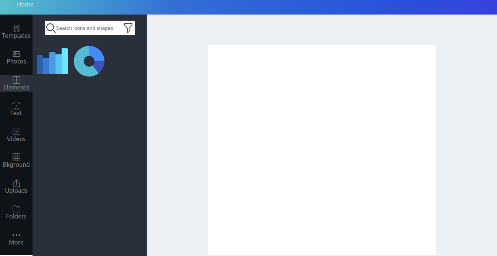
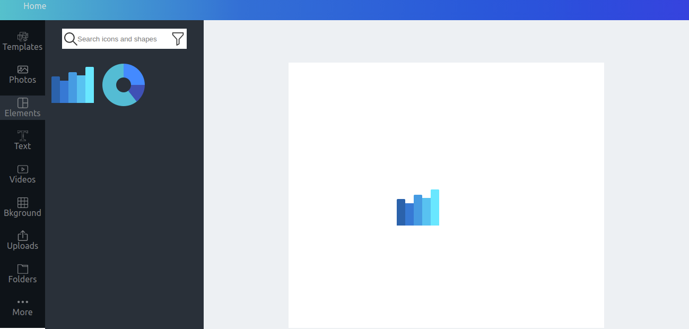
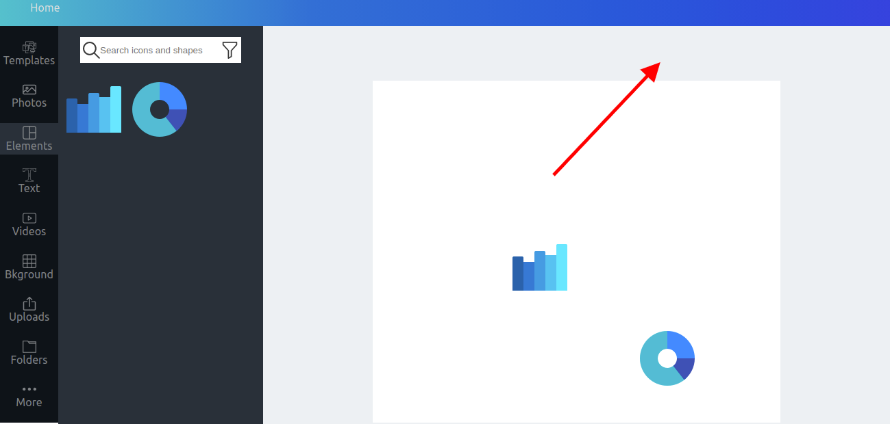

# Guidanz Task

1.Create side Menu with Bar and pie chart Widgets
2.create A4 Sheet layout
3.Drag and Drop Bar or Pie Chart Widget
4.Move around A4 Sheet and place it anywhere in A4 Sheet layout

##List of things tried:

- React js
- Native HTML drag and drop
- Used local Storage for caching
- Used Context for global store

## Sample Screenshot step by step here

1.

2.

3.

4.

